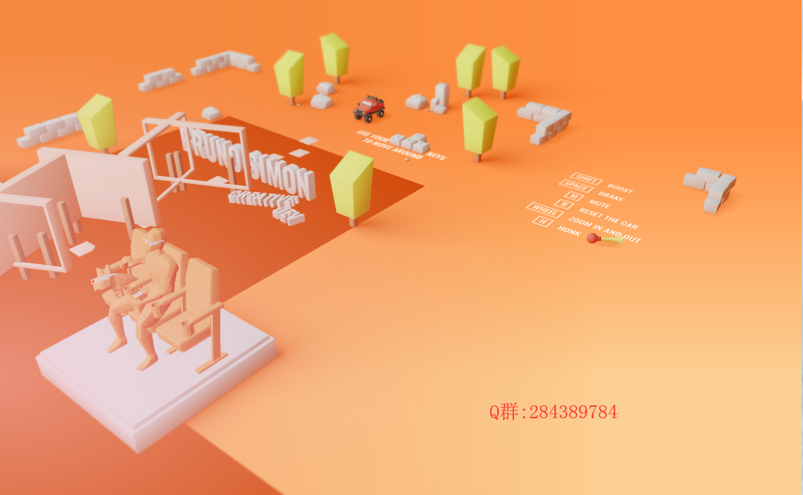

# 一个场景

被放鸽子以后的一个开源 ，给别人做项目别放鸽子了，心情郁闷，写个开源缓解心情

## 概述

被放鸽子以后的一个开源 ，给别人做项目别放鸽子了，心情郁闷，写个开源缓解心情

## 效果

## 安装使用

    下载项目，或者git clone
    下载完成打开目录，安装包

    cnpm install 使用国内镜像要快一点
    or
    npm install

    安装完成后运行即可
    npm run dev

## 总结

    本人webgl/threejs开发经验7年左右，一直以来都想着开源，结交更多志同道合的朋友
    希望开源能帮到大家
    webgl/three.js/ 学习交流群：284389784 by: 换孤
    我的github地址：https://github.com/yszhao91 欢迎大家follow star
    其他项目看我主页
    https://github.com/yszhao91/xtorcga 是我开源的一个几何算法库
    更多开源后续慢慢展开

## 安慰我

尽可能 STAR 我
要么给钱

